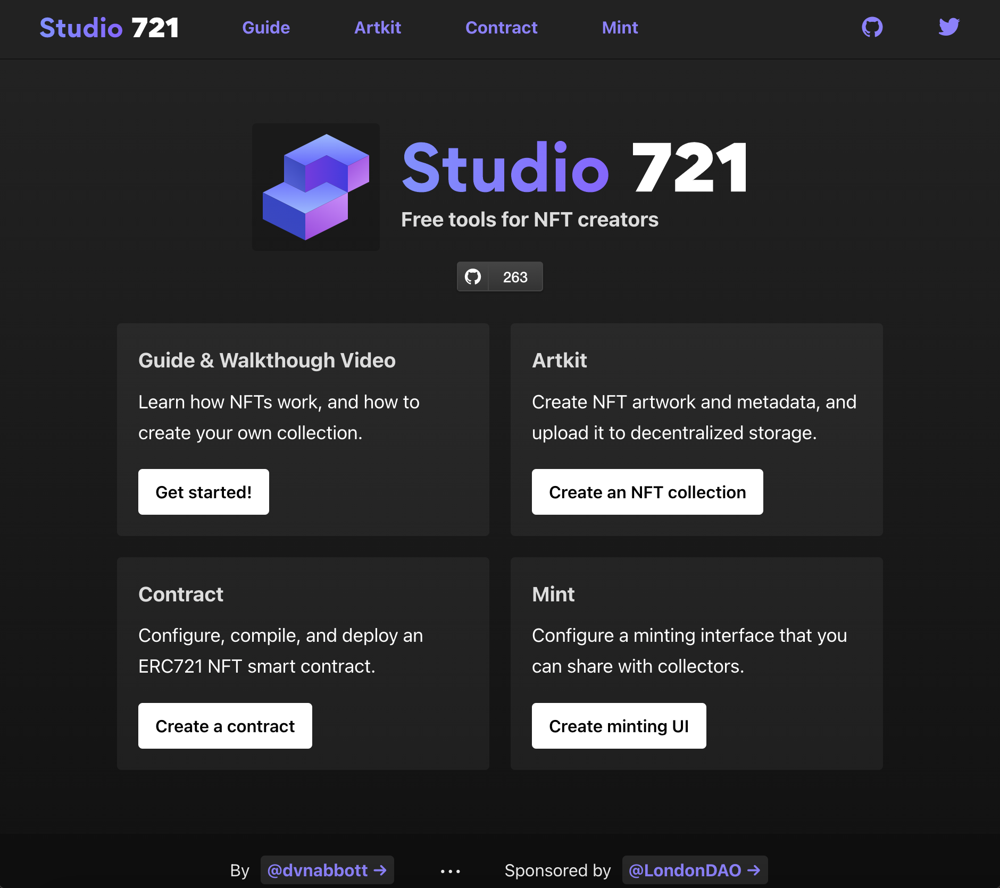

# 721.so 使用指南

常遇到一些新手想要发行自有合约的ERC721 NFT，通常我会推荐他们可以利用721.so上的工具自行布署，这工具网站是一个早年因为NFT跟ETH而财富自由的编程员所开发的好心网站。

网上这类布署的工具网站很多，我推荐这网站有以下几个原因：

1. 他不收费，没有隐藏成本，有些工具网站回酌收少许费用，有些工具网站采用的是首次交易抽水，但721.so什么都没收，不过布署的Gas费还是要自己付。
2. 支持大部分的EVM公链，目前测试下，EVM除了像zkEVM这种比较拐的，其他EVM公链只要把钱包切换成该公链，就可以直接布署在该链上，包括测试链也是的。
3. 流程简单，基本需求填写好，然后按照提示一步一步，就可以完成布署，验证的部分稍微复杂了点，因为需要去申请API KEY，但已经是目前我测试过最简单的流程了。
4. 功能覆盖面大，虽然写不出什么质压之类的功能，但是大多数的功能都可以用勾选的，挺方便的。
5. 弹性度高，如果你会自己写Solidity合约语言，你可以透过工具生成后，另外自行修改，我大多数的时候都用这个方式，让他生产一个版模，然后再下载修改成自己要的功能。
6. 提供打包功能，包过源码等等都能打包。

这网站还提供一些例如图片组合的功能，但那些我没测试，改日再说。

当然要说功能最强大，我觉得还不至于，有些网站甚至提供其中种类公链的布署，甚至可以把铸造页面都帮你设计好（721.so有个简易版的），不过这样的网站就不是免费的

# 正文开始

进到[https://www.721.so/](https://www.721.so/) 之后，可以看到网站非常简约

ArtKit就是用来组合图片，Contract主要是合约撰写跟布署的功能，Mint就是产生铸造页面的地方。

有兴趣的也可以认真看一下Guide的页面，里面有对于功能的详细说明，我们今天先从Contract开始说明，点进去后会看到以下页面

左边是透过勾选来修改合约的功能，右上则是合约的原始码，右下就是执行步骤，合约写好后有三个步骤，一是Compile（编译），Deploy（布署），Verify（验证）

如果你选择Polygon公链，Deploy就会显示Deploy on Polygon，同理你选择其他公链，他都会显示你准备在哪个公链布署，也可以选择测试链，我现在就是选择Sepolia，因为这是后来才上线的Eth测试链，所以他显示undefined，不过一样可以正常布署。

我们先来看左边可以勾选的部分

在说明这一页的功能之前，我先简单介绍一下[ERC721](https://github.com/punkcanyang/EasyBlockChain/blob/main/ERC%E5%8D%8F%E8%AE%AE%E5%85%A5%E9%97%A8.md)的结构

每一个ERC721，会有一个NFT的ID，称之为Token ID，每一个ID将对应一个Token URI，URI是这个ID的NFT的[Metadata](https://github.com/punkcanyang/EasyBlockChain/blob/main/NFT/NFT%E4%B8%8B%E7%9A%84Metadata%E8%AF%A5%E5%A6%82%E4%BD%95%E6%92%B0%E5%86%99.md)储存在网上的哪个位置，所谓的[Metadata](https://github.com/punkcanyang/EasyBlockChain/blob/main/NFT/NFT%E4%B8%8B%E7%9A%84Metadata%E8%AF%A5%E5%A6%82%E4%BD%95%E6%92%B0%E5%86%99.md)就是这个NFT的资料，例如图片，说明，特殊属性等等

像这个范例中的URI是https://www.721.so/api/example/metadata/{tokenId} 

如果ID是999，他对应的URI就是https://www.721.so/api/example/metadata/999

[Metadata](https://github.com/punkcanyang/EasyBlockChain/blob/main/NFT/NFT%E4%B8%8B%E7%9A%84Metadata%E8%AF%A5%E5%A6%82%E4%BD%95%E6%92%B0%E5%86%99.md)可以储存在IPFS或是一般的HTTP位置，当然也可以直接写在链上，不过储存在链上的成本很高，整个Metadata存在链上的成本也会跟着变高

上面这张图最后上面的「Preview of Token」，后面如果填入数字，就可以根据你填写「Token URI」显示预览图片，对于新手布署[Metadata](https://github.com/punkcanyang/EasyBlockChain/blob/main/NFT/NFT%E4%B8%8B%E7%9A%84Metadata%E8%AF%A5%E5%A6%82%E4%BD%95%E6%92%B0%E5%86%99.md) ，可以检查一下自己的图片是否正确。

「Name」就是这个NFT系列的名称

「Abbreviation」，NFT系列的缩写，又称为符号，就跟USDT是Tether USD的缩写是一样的意思

「Supply」，总供应量，如果被铸造到这个数量就不能再铸造了

「Price」，铸造价格，这些的铸造价格是固定的，有了铸造价格，用户需要付钱才能够进行铸造，这边付的钱只能用该链的本币，例如你在以太布署，这里的就是以太币的数量，如果你是用BSC发布，这里就是BNB的数量

「Royalties」创作者分润，如果贩售的市场支援「Royalties」的功能，之后的每次贩售都可以根据这个设定抽成给原始创作者，不过支持这个功能的市场，目前不多

「Contract URI」是项目URI的，前面说到每个NFT都有一个对应的Metadata，项目他也有一个Metadata，用来放项目的介绍等等，市场会显示在项目页，如果你没有设定这个，就需要去每个卖场设定

我们可以看到有些项目有勾选的方块，那些就是非必要填写的，如果没有方块的，就是必要填写。

再往下看，会看到这个

OpenPalette主要是先帮你把一些可以展开的选项先勾起来，避免你没注意到

接下我们来讲解这个区块的功能

「Reduce deployment costs」可以用来降低布署的成本，但是如果用了这个，就不能使用「Enumerable」跟「Approval Proxy」的功能。

「Multimint」如果勾选，用户可以一次mint多个NFT，后面数字是用来填写一次mint的上限，要注意这个数字不能过大，因为智能合约每次执行都有算力上限，如果你一次mint 200个，估计会得到错误信息（最大多少我不知道，不过如果没有写一些特殊功能，一次50个我测试是可以的）

「Minting limit per wallet」每个钱包最多可以mint几个，这可以让你的NFT持有者尽可能分散，而不是集中在少数人手上

「Mint specific ids」用户可以指定他们要铸造的ID，如果没有勾选，数字就会递增，如果要随机不指定ID就得要自己去改源码了，这个工具不支持这个功能，也不难，就是布署跟Mint的Gas会增加

「Maximum token id」是自行指定ID的最大值，这个值必须要超过或等于最大供应量「Supply」，不然会有NFT分配不到ID，如果你这里设定5000，「Supply」设定1000，代表用户可以在5000内指定ID，但是NFT铸造满1000个就不能铸造了

「Require access token」，用户必须持有另一个凭证NFT才能够进行mint，721.so的设计是，如果你勾选了「Mint specific ids」，你凭证NFT的ID是多少，新的NFT的ID就是多少，不过如果你没有勾选「Mint specific ids」，他就只会检查你有没有该NFT，有就给铸造，如果想要不同规则，就得要自己改

「Add function to disable」让你可以关掉「Require access token」的功能，你可以用来设计成预售的功能，例如先发预售NFT给预售者，他们就可以持NFT来Mint，等到预售期过了，在开放给公众mint

「Add function to change」让你可以修改凭证NFT的合约地址

「Mainnet address」这一系列XXXX address就是凭证NFT的合约地址，他这个不是写在合约中，而是布署时填入的参数，如果要取出源码自己布署，需要特别注意

「Only the owner can mint」将限制只有布署钱包才能够Mint

「Enumerable」这提供了可以搜寻用户有哪些NFT的功能，如果选择「Reduce deployment costs」，就不能启用这个功能，如果是纯创作图片的NFT，这功能不太需要，这会消耗蛮多Gas，但是如果你未来需要比较复杂的赋能，例如用户拥有哪几张就可以行使特定权利，就需要打开这个你功能，当然你也可以使用线下数据表来做这件事情（建立一个线下的表，扫描每一个NFT的持有者，这样也是可以，就是即时性不够，容易被作弊）

「Minting starts active」可以设定关闭或是开启铸造

「Approval Proxy」可以让你预先授权给特定市场，让用户在买卖你的NFT时，不用额外付授权的Gas，这个很有用，不过721.so只有提供Opensea的预先授权，如果要完整，得要自己改

「Set token URIs individually」会让每一个NFT指定特定的Metadata，如果不勾选，Metadata的位置只会修改最后的Token ID，如果你勾选了这个功能，每一个NFT需要指定一个Metadata才行，相当消耗Gas，不过如果是艺廊，可能会有这个需求

接下来讲一个比较奇特的功能「****Token Parameters****」

「****Token Parameters****」主要是让你在mint时，放入额外的链上数据对应指定ID，例如最早的持有人可以写入数据，之后不管如何换手，都可看到这组数据。

上面基本上都设定的差不多了，我们来讲最后三个设定

「****Payout****」可以指定提现的时候将合约里的本币分给哪些钱包，可以设定比例

「****Allowlist****」只允许特定钱包Mint，721.so这功能写的阳春的，如果你要用来当白名单，需要改源码

「****Contract Verification****」合约布署后，会需要验证合约之后，才会成为一个开源合约，开源合约可以比较容易被用户信任，不过如果要验证合约，就需要去该链申请一个API，这个我之后再写一篇教学

好了到这边我们算是设定完毕了，接下来就是「Compile」的动作了，按下去就是了

按下去后会出现编译中的画面

编译完会出现以下画面

如果出现「**Compiled successfully**」就是编译成功了，而且会出现四个可以下载的档案，这四个档案如果你是自己去链上验证合约，就需要下载

- solidity files
- compiler input
- compiler output
- ABI

编译完了之后就是布署「Depoly」，一样点下去，等他一下，小狐狸钱包就会弹出要确认的弹窗

不过这是测试网，他计算的Gas是1.5Gwei，如果是在主网，至少也要15，因此大约要十倍的成本，如果遇到主网阻塞，会更高。

布署好了，就会出现这个弹窗

画面也会出现布署成功的网址「**0x1A6Ee8EcC5AE5E06c6b63B9DfF36cCC86ea2f573**」

如果你有申请过API，请填写到右边这里，这样「Verify」才能使用

不过这边有个小问题，平台自动验证需要是721.so认得的链，不然他会找不到验证用的API，所以我用Polygon的测试网又重新布署了一次

验证后会看到验证成功的资料

我们到 [https://mumbai.polygonscan.com/address/0x9E2b34A3f5392e2a3392e79ead076e7596fF64A4](https://mumbai.polygonscan.com/address/0x9E2b34A3f5392e2a3392e79ead076e7596fF64A4) 看一下布署的成果

接下来我们点击 721.so 上的mint，做一个简单的铸造页面

把布署好的合约地址填进去，会出现以下的页面

点了编辑后就可以修改细节

如果现在项目是可以铸造的，就可以看到mint的按钮

mint后就会开始进入钱包交互的过程

确定后就成功铸造NFT了

